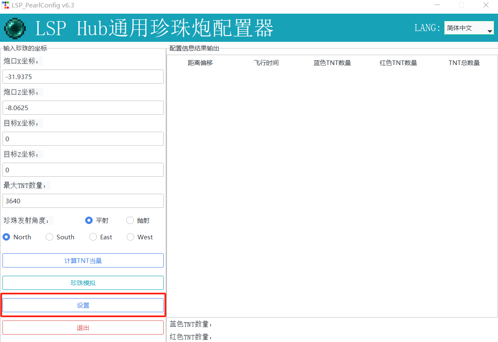
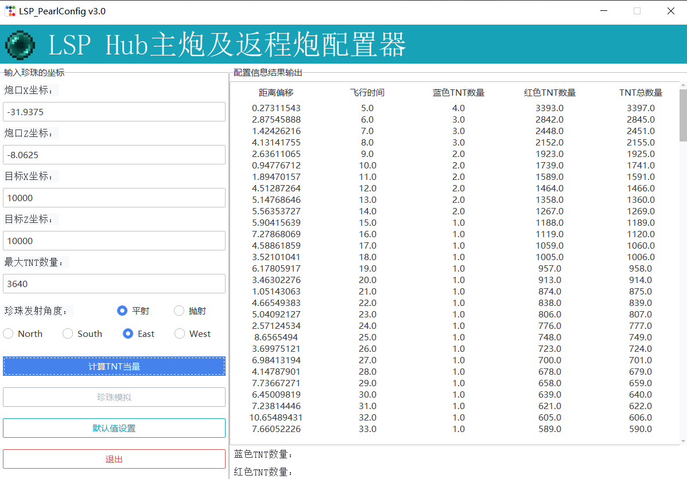
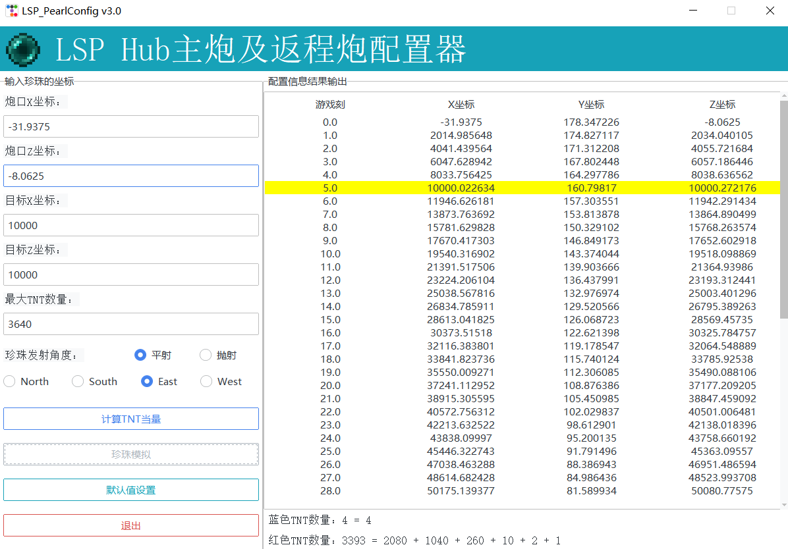
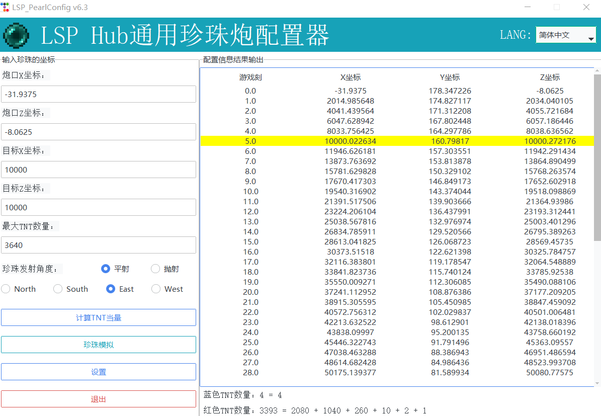

# LSP服务器通用珍珠炮配置器

> 这是一个通用珍珠炮计算器
> 请在release中下载最新的版本😘😘😘

### 1. 配置指南

##### 第一步、初始化珍珠计算器

由于不同的珍珠炮构架不同，在正式开始使用时需要进行初始配置，初始配置完成后即可持续使用；如果更换了珍珠炮，也需要重新进行初始配置。打开珍珠配置器，你会看到如下界面，点击“设置”按钮：

接下来将弹出如下的窗口：

接下来，进入到游戏中，确保你的客户端可以输入并显示`log projectiles full`指令。如果你的珍珠炮具有抛射模式，请打开抛射开关。填写完成后，点击“预览/刷新”按钮，检查是否填写正确；填写正确则点击“使用预览中的结果”按钮，应用会自动重启并完成设置。你也可以在填写并预览无误后点击"导出设置"，将设置保存并分发给你的朋友。点击“导入设置”，将设置文件导入，预览无误后点击“使用预览中的结果”按钮即可。

##### 第二步、输入目的地，计算TNT配置并进行模拟

这里以前往（10000，10000）为例，填写目的地坐标，选择平射还是抛射，点击“计算TNT当量”，在右侧的“配置信息结果输出”页面中选中你想要的配置，右侧页面底部显示了你选择的配置中TNT数量的详细信息，你可以按照这个更加方便的将TNT数量信息写在珍珠炮配置中。

随后，点击“珍珠模拟”按钮，即可在右侧页面中看到珍珠轨迹模拟的结果，珍珠到达目的地的时刻与位置标黄便于查找。

##### 另：修改应用语言

在应用主界面的右上角可以修改应用的语言，目前支持English，简体中文，繁体中文。如果需要更多语言支持请按照[这份文件](./resources/languages/languages.json)生成语言配置文件。

### 2. 配置算法

详细的配置算法请看[这里](resources/docs/Config.pdf)

### 技术栈

Python

### License

GPL-3.0 license