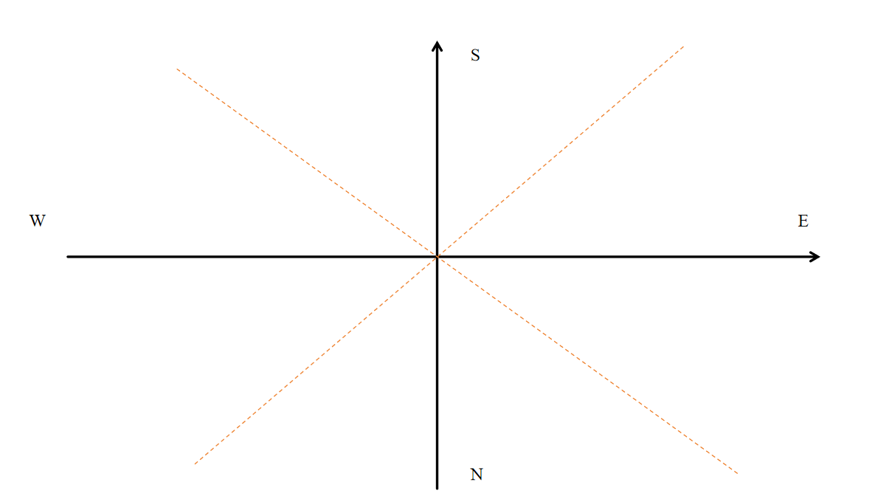

# 珍珠炮配置算法——LSP服务器主炮及返程炮配置

> 本文作者：Alan & 御河DE天街
> 写在前面：阅读本文需要一定的数学基础，如果只是想单纯配置珍珠炮请看后续配置指南

目录
- [珍珠炮配置算法——LSP服务器主炮及返程炮配置](#珍珠炮配置算法lsp服务器主炮及返程炮配置)
  - [1. 配置算法的相关数学推导](#1-配置算法的相关数学推导)
    - [1.1. 前期准备](#11-前期准备)
      - [1.1.1. 珍珠的运动规律——v-t函数](#111-珍珠的运动规律v-t函数)
      - [1.1.2. 珍珠的运动规律——S-t函数](#112-珍珠的运动规律s-t函数)
    - [1.2. 平射的配置](#12-平射的配置)
      - [1.2.1. 方向判断](#121-方向判断)
      - [1.2.2. 计算所需动量](#122-计算所需动量)
      - [1.2.3. 建立动量方程](#123-建立动量方程)
      - [1.2.4. 调整结果](#124-调整结果)
    - [1.3. 抛射的配置](#13-抛射的配置)
      - [1.3.1. 方向判断](#131-方向判断)
      - [1.3.2. 计算所需动量](#132-计算所需动量)
      - [1.3.3. 建立动量方程](#133-建立动量方程)
      - [1.2.4. 调整结果](#124-调整结果-1)
  - [2. 配置指南](#2-配置指南)

## 1. 配置算法的相关数学推导

### 1.1. 前期准备

在正式开始推导之前，我们需要给出“珍珠动量”的准确定义。
珍珠在运动时，每 gt 会出现在一个特定的位置；因此 $t_{0} + 1$ gt 到 $t_{0}$ gt 之间存在一个位置差，我们定义这个位置差为珍珠在 $t_{0}$ gt 时的动量。事实上，“动量”这个说法只是习惯上的说法，更准确的说法应该为“珍珠速度”。

接下来，我们给出一些常数(这些常数在不同的珍珠炮中可能不同，需要测量)，即1个TNT赋予珍珠的水平方向动量大小 $m_{0}$，y轴方向动量大小 $m_{y}$，珍珠发射时具有的初始y动量 $m_{y_{0}}$

$$
\text{平射：}\begin{cases}
  m_{0} = 0.6025678975452011, \\
  m_{y} = -0.0011162018688096187, \\
  m_{y_{0}} = 0.2716278719434352
\end{cases}\qquad
\text{抛射：}\begin{cases}
  m_{0} = 0.6026063622295216, \\
  m_{y} = 0.000639233791587035, \\
  m_{y_{0}} = 0.6909788463066233
\end{cases}
$$

#### 1.1.1. 珍珠的运动规律——v-t函数

设 $V_{xz}(t)$ 表示t时刻珍珠在X，Z轴方向上的动量， $V_{y}(t)$ 表示t时刻珍珠在Y轴方向上的动量；并设 $V_{xz}(0)$，$V_{y}(0)$ 表示珍珠开始运动时具有的初始动量。根据wiki上的资料，珍珠在运动时，三轴动量满足如下运动规律：

$$
V_{xz}(t+1) = 0.99·V_{xz}(t)
$$
$$
V_{y}(t+1) = 0.99·V_{y}(t) -0.03
$$

显然，$\{V_{xz}(t), t \geqslant 0, t\in\mathbb{N}\}$ 是一个等比数列，故根据等比数列的相关性质可以得到 $V_{xz}(t) = 0.99^{t}·V_{xz}(0)$。

而对于 $V_{y}(t)$，做如下变换：

$$
\frac{V_{y}(t+1)}{0.99^{t+1}} = \frac{V_{y}(t)}{0.99^{t}} - \frac{0.03}{0.99^{t+1}} \Rightarrow \frac{V_{y}(t+1)}{0.99^{t+1}} - \frac{V_{y}(t)}{0.99^{t}} = - \frac{0.03}{0.99^{t+1}}
$$

将上式进行累加，可以得到：

$$
\frac{V_{y}(t)}{0.99^{t}} - \frac{V_{y}(0)}{0.99^{0}} = -0.03\left(\frac{1}{0.99^{1}} + \frac{1}{0.99^{2}} + \cdots + \frac{1}{0.99^{t}}\right) \Rightarrow \frac{V_{y}(t)}{0.99^{t}} = V_{y}(0) - 0.03\left(\frac{1}{0.99^{1}} + \frac{1}{0.99^{2}} + \cdots + \frac{1}{0.99^{t}}\right)
$$

于是，进一步化简可以得到：

$$
\frac{V_{y}(t)}{0.99^{t}} = V_{y}(0) - 0.03\left[\frac{\frac{1}{0.99}\left(1 - \frac{1}{0.99^{t}}\right)}{1 - \frac{1}{0.99}}\right] = V_{y}(0) + 3\left(1 - \frac{1}{0.99^{t}}\right)
$$

于是得到, $V_{y}(t) = 0.99^{t}\left[V_{y}(0) + 3\right] - 3$

综上所述，珍珠在t时刻的动量满足如下结果(v-t函数)：

$$
\begin{cases}
  V_{xz}(t) = 0.99^{t}·V_{xz}(0), \\
  \\
  V_{y}(t) = 0.99^{t}\left[V_{y}(0) + 3\right] - 3
\end{cases}
$$

#### 1.1.2. 珍珠的运动规律——S-t函数

设 $S_{xz}(t)$ 表示 $(0, t]$ 时间段内X，Z轴方向上珍珠飞行的位移，$S_{y}(t)$ 表示 $(0, t]$ 时间段内Y轴方向上珍珠飞行的位移。可以发现，$(0, t]$ 时间段内，珍珠飞行的位移分别为:

$$
S_{xz}(t) = \sum_{i=0}^{t}V_{xz}(i)\\
S_{y}(t) = \sum_{i=0}^{t}V_{y}(i)
$$

于是由等比数列的性质可得：$S_{xz}(t) = \frac{V_{xz}(0)(1 - 0.99^t)}{1 - 0.99} = 100V_{xz}(0)(1 - 0.99^t)$。

对于Y轴方向上珍珠飞行的位移，先改写Y轴动量公式： $V_{y}(t) + 3 = 0.99^{t}\left[V_{y}(0) + 3\right]$。令 $a_{t} = V_{y}(t) + 3$。于是有 $a_{t} = 0.99^{t}a_{0}$。

对 $\{a_{t}, t \geqslant 0, t\in\mathbb{N} \}$ 求和，可以得到：

$$
\sum_{i=0}^{t}a_{i} = \sum_{i=0}^{t} \left[V_{y}(i) + 3\right] = \sum_{i=0}^{t}V_{y}(i) + 3t = \frac{\left[V_{y}(0) + 3\right](1 - 0.99^t)}{1 - 0.99}
$$

从而得到，$S_{y}(t) = \frac{\left[V_{y}(0) + 3\right](1 - 0.99^t)}{1 - 0.99} -3t = 100\left[V_{y}(0) + 3\right](1 - 0.99^t) - 3t$ 。

综上所述，珍珠 $(0, t]$ 时间段内飞行的位移满足如下结果(S-t函数)：

$$
\begin{cases}
  S_{xz}(t) = 100V_{xz}(0)(1 - 0.99^t), \\
  \\
  S_{y}(t) = 100\left[V_{y}(0) + 3\right](1 - 0.99^t) - 3t
\end{cases}
$$

### 1.2. 平射的配置

#### 1.2.1. 方向判断

如图所示，一、三象限角平分线以及二、四象限角平分线将平面划分为4个区域，从X轴正方向开始逆时针来看，四个区域依次对应的是东，南，西，北四个方向。对于任意目的地坐标，需要判断其相对于炮口坐标的方向，只需要以炮口为原点，观察目的地坐标位于哪个区域即可。

为了方便计算，对目的地坐标做如下变换：

设 $(x_0, z_0)$ 表示炮口坐标，$(x_1, z_1)$ 表示目的地坐标。将坐标原点移动至炮口处，于是目的地坐标为 $(x_1-x_0, z_1-z_0)$ 。令 $X = \begin{bmatrix}
  x_1-x_0 \\
  z_1-z_0
\end{bmatrix}$ 为目的地相对于炮口的位置。

定义旋转矩阵 $R = \begin{bmatrix}
  \cos\theta & -\sin\theta \\
  \sin\theta & \cos\theta 
\end{bmatrix}$，将目的地坐标顺时针旋转45°(即将坐标轴逆时针旋转45°)，得到 $X^{\prime} = R^T·X$。其中 $X^{\prime} = \begin{bmatrix}
  x^{\prime} \\
  z^{\prime}
\end{bmatrix}$

接下来只需要判断 $X^{\prime}$ 落在哪个象限即可得出相对炮口的方向；每对应一个方向，红色阵列和蓝色阵列赋予珍珠的动量的方向向量随即确定，将这两个方向向量拼成一个方向矩阵 $D$，则可以获得如下的结果：
$$
D = \begin{cases}
  \begin{bmatrix}
    1 & 1 \\
    -1 & 1
  \end{bmatrix} & x^{\prime} \ge0, z^{\prime} < 0, \text{east} \\
  \\
  \begin{bmatrix}
    -1 & -1 \\
    -1 & 1
  \end{bmatrix} & x^{\prime} \le0, z^{\prime} > 0, \text{west} \\
  \\
  \begin{bmatrix}
    1 & -1 \\
    1 & 1
  \end{bmatrix} & x^{\prime} > 0, z^{\prime} \ge 0, \text{south} \\
  \\
  \begin{bmatrix}
    1 & 1 \\
    -1 & -1
  \end{bmatrix} & x^{\prime} < 0, z^{\prime} \le 0, \text{north}
\end{cases}
$$

#### 1.2.2. 计算所需动量

设 $P_x$，$P_z$ 分别表示到达目的地所需的X，Z轴动量。结合[之前](#112-珍珠的运动规律s-t函数)获得的S-t函数，可以得到珍珠飞行 t gt 后到达目的地所需的动量为：

$$
\begin{cases}
  P_x = x_1 - x_0 = \frac{V_x(0)(1-0.99^t)}{1-0.99} = 100V_x(0)(1-0.99^t) \\
  \\
  P_z = z_1 - z_0 = \frac{V_z(0)(1-0.99^t)}{1-0.99} = 100V_z(0)(1-0.99^t)
\end{cases}
$$

#### 1.2.3. 建立动量方程

设 $N_B$，$N_R$ 分别表示蓝色阵列和红色阵列的TNT数量。构建TNT数量于动量之间方程：

$$
m_0 · D · \begin{bmatrix} N_B \\ N_R \end{bmatrix} = \begin{bmatrix} P_x \\ P_z \end{bmatrix}
$$

方程的解即为初步的配置信息。

#### 1.2.4. 调整结果

获得初步的解之后，需要根据距离目标点的偏差对 $N_B$，$N_R$ 的数值进行调整，于是令 $N = \begin{bmatrix}
  N_B \pm 5 \\
  N_R \pm 5
\end{bmatrix}$，带入动量方程计算出调整之后到达目的地所需的X，Z轴动量 $P_x$，$P_z$，然后计算出实际落点位置与目标位置之间的偏差，选取使得偏差最小的 $\begin{bmatrix}
  N_B  \\
  N_R 
\end{bmatrix}$ 作为最终的结果输出。

### 1.3. 抛射的配置

#### 1.3.1. 方向判断

设 $(x_0, y_0, z_0)$ 表示炮口坐标，$(x_1, y_1, z_1)$ 表示目的地坐标。与平射配置方法相同，见[1.2.1. 方向判断](#121-方向判断)

#### 1.3.2. 计算所需动量

设 $P_x$，$P_y$，$P_z$ 分别表示到达目的地所需的X，Y，Z轴动量。结合[之前](#112-珍珠的运动规律s-t函数)获得的S-t函数，可以得到珍珠飞行 t gt 后到达目的地所需的动量为：

$$
\begin{cases}
  P_x = x_1 - x_0 = \frac{V_x(0)(1-0.99^t)}{1-0.99} = 100V_x(0)(1-0.99^t) \\
  \\
  P_y = y_1 - y_0 = \frac{\left[V_y(0) + 3\right](1-0.99^t)}{1-0.99} - 3t = 100\left[V_y(0) + 3\right](1-0.99^t) -3t \\
  \\
  P_z = z_1 - z_0 = \frac{V_z(0)(1-0.99^t)}{1-0.99} = 100V_z(0)(1-0.99^t)
\end{cases}
$$

#### 1.3.3. 建立动量方程

设 $N_B$，$N_R$ 分别表示蓝色阵列和红色阵列的TNT数量。由于抛射的射程一般较远，因此我们设法使得珍珠到达目的地时Y轴位置也恰好在y=128的位置，这样就可以不用修建拦截珍珠的珍珠台。

我们直到，珍珠出膛时，Y轴动量与红蓝阵列的TNT总数之间存在关系：

$$
N_B + N_R = \frac{P_y - m_{y_0}}{m_y}
$$

要到达目标点，显然需要满足我们在1.2.3得到的方程，但是由于我们已经获得了一个方程，因此，我们将1.2.3中的两个方程相除，然后与上述方程联立即可求解：

令 $\begin{bmatrix} P_1 \\ P_2 \end{bmatrix} = D · \begin{bmatrix} P_x \\ P_z \end{bmatrix}$ ($D$ 表示方向矩阵)，则可以得到动量方程：
$$
\begin{bmatrix} 1 & 1 \\ P_1 & P_2 \end{bmatrix} · \begin{bmatrix} N_B \\ N_R \end{bmatrix} = \begin{bmatrix} \frac{P_y - m_{y_0}}{m_y} \\ 0 \end{bmatrix}
$$

方程的解即为初步的配置信息。

#### 1.2.4. 调整结果

获得初步的解之后，需要根据距离目标点的偏差对 $N_B$，$N_R$ 的数值进行调整，于是令 $N = \begin{bmatrix}
  N_B \pm 10 \\
  N_R \pm 10
\end{bmatrix}$，带入动量方程计算出调整之后到达目的地所需的X，Z轴动量 $P_x$，$P_z$，然后计算出实际落点位置与目标位置之间的偏差，选取使得偏差最小的 $\begin{bmatrix}
  N_B  \\
  N_R 
\end{bmatrix}$ 作为最终的结果输出。

## 2. 配置指南

[https://github.com/FantasySilence/LSP_PearlCannonConfig](https://github.com/FantasySilence/LSP_PearlCannonConfig)
