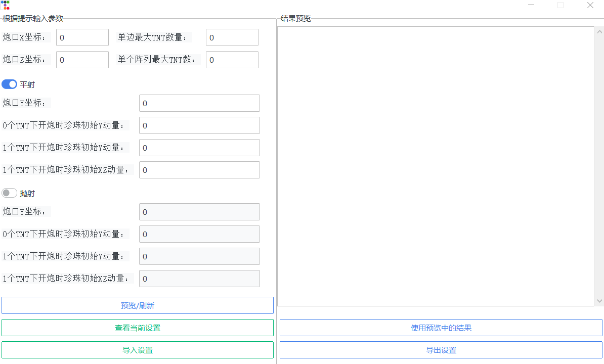
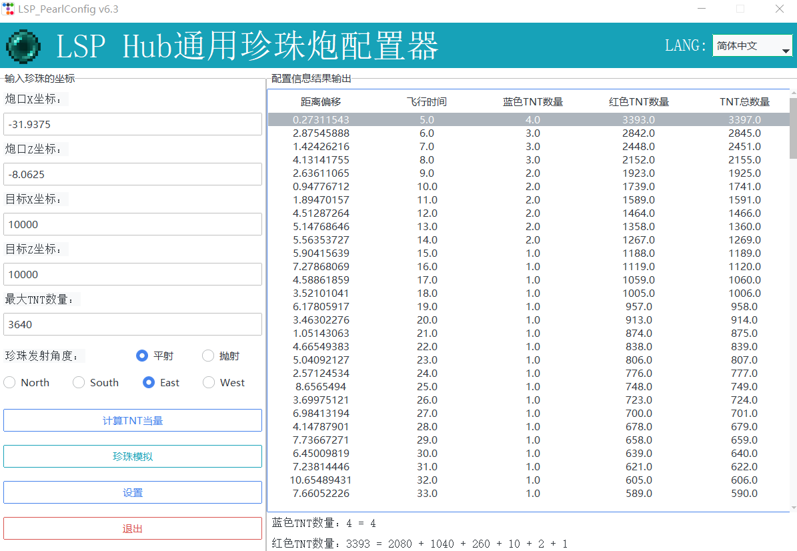

# LSP服务器专用珍珠炮配置器

### 1. 配置指南

##### 第一步、打开应用填写

打开珍珠配置器，你会看到如下界面：

填写“目标X坐标”以及“目标Z坐标”，并选择珍珠的发射角度，即平射还是抛射。这里我们选择以平射方式前往坐标点(10000, 10000)

##### 第二步、计算TNT配置并进行模拟

点击按钮“计算TNT当量”，下方的按钮会显示目标点相对于炮口的方向，在右侧的“配置信息结果输出”页面中会出现配置的结果：

在右侧的“配置信息结果输出”页面中选中你想要的配置，点击“珍珠模拟”按钮，即可在右侧页面中看到珍珠轨迹模拟的结果，珍珠到达目的地的时刻与位置标黄便于查找。右侧页面底部显示了你选择的配置中TNT数量的详细信息，你可以按照这个更加方便的将TNT数量信息写在珍珠炮配置中。

##### 另：修改输入框的默认值

相信你已经注意到，打开应用时，“炮口X坐标”，“炮口Z坐标”，“最大TNT数量”这三个输入框具有默认值。如果想要更改则点击“默认值设置”按钮，在弹出的窗口中重新填写即可。填写后点击“应用”，新的默认值设置即时生效。

### 2. 配置算法

详细的配置算法请看[这里](resources/docs/Config.pdf)

### 技术栈

Python

### License

GPL-3.0 license